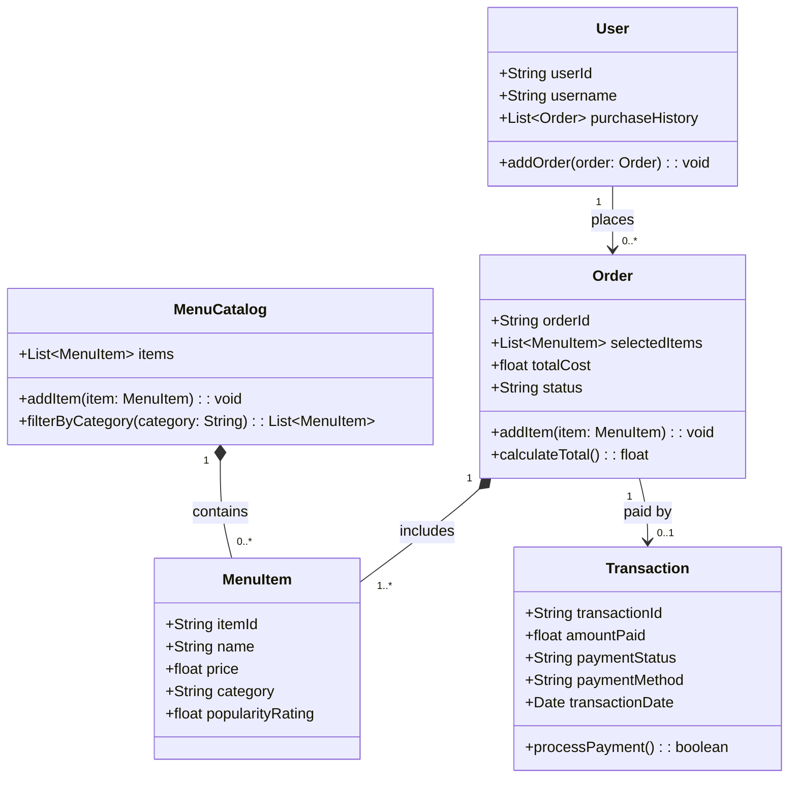

# ByteBites

> A fast, personalized campus food ordering backend — built with clean object-oriented Python.

---

## Overview

ByteBites is the backend engine for a campus food ordering app. It models the full lifecycle of a food order: browsing a menu, selecting items, computing a total, and processing payment — all through a set of well-defined, spec-driven Python classes.

This project demonstrates object-oriented design, UML-to-code translation, and test-driven development using Python's built-in `unittest` framework.

---

## Features

- Browse and filter a live menu catalog by category (e.g. "Burgers", "Drinks", "Desserts")
- Build orders dynamically with auto-updating totals
- Process payments with pass/fail logic tied directly to order cost
- Track a user's full purchase history

---

## Project Structure

```
bytebites_tinker_activity/
├── models.py               # Core data models (User, MenuCatalog, MenuItem, Order, Transaction)
├── test_bytebites.py       # Unit tests for core functionality
├── bytebites_spec.md       # Feature requirements and candidate class definitions
├── uml_class_diagram.md    # Mermaid UML class diagram
└── README.md
```

---

## Data Models

| Class | Responsibility |
|---|---|
| `User` | Stores customer identity and purchase history |
| `MenuCatalog` | Holds all menu items; supports category filtering |
| `MenuItem` | Represents a single food or drink product |
| `Order` | Groups selected items and computes the total cost |
| `Transaction` | Records payment details and processes the charge |

---

## Quickstart

No external dependencies required — runs on standard Python 3.10+.

```bash
# Clone the repo
git clone <your-repo-url>
cd bytebites_tinker_activity

# Run the test suite
python -m unittest test_bytebites -v
```

---

## Test Coverage

```
test_calculate_total_with_multiple_items  ... ok   # $10 burger + $5 soda = $15
test_calculate_total_on_empty_order       ... ok   # empty order returns $0.00
test_filter_returns_only_matching_category ... ok  # category filter returns correct items
test_filter_matches_regardless_of_case   ... ok   # "drinks" matches "Drinks"
test_payment_succeeds_when_amount_covers_total ... ok
test_payment_fails_when_amount_is_insufficient ... ok
test_add_order_appends_to_purchase_history     ... ok

Ran 7 tests in 0.000s — OK
```

---

## UML Class Diagram



---

## Skills Demonstrated

- Object-oriented design with Python dataclasses and type hints
- UML class diagram design and spec-to-code translation
- Unit testing with `unittest` — covering happy paths, edge cases, and conditional logic
- Clean code structure with single-responsibility classes

---

## Author

Built by Tokslaw as part of the CodePath AI Engineering program.
