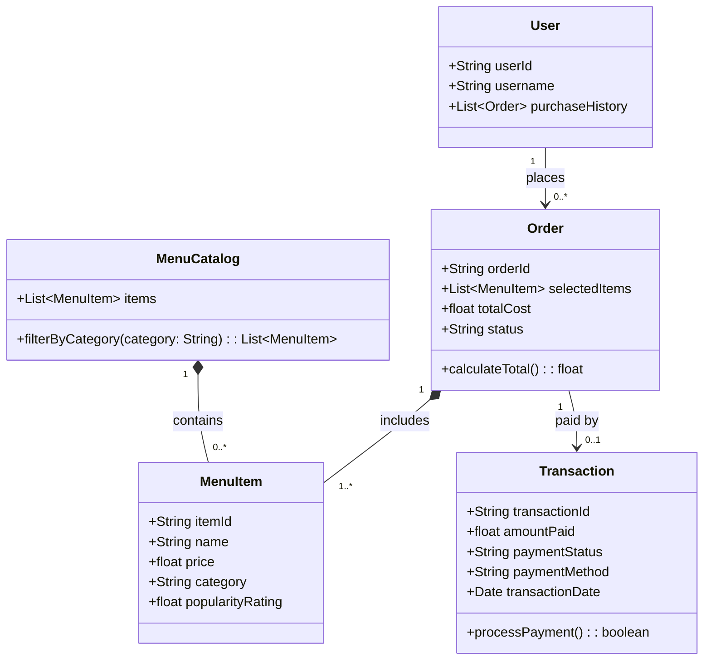

# ByteBites UML Class Diagram

```mermaid
classDiagram
    class User {
        +String userId
        +String username
        +List~Order~ purchaseHistory
    }

    class MenuCatalog {
        +List~MenuItem~ items
        +filterByCategory(category: String): List~MenuItem~
    }

    class MenuItem {
        +String itemId
        +String name
        +float price
        +String category
        +float popularityRating
    }

    class Order {
        +String orderId
        +List~MenuItem~ selectedItems
        +float totalCost
        +String status
        +calculateTotal(): float
    }

    class Transaction {
        +String transactionId
        +float amountPaid
        +String paymentStatus
        +String paymentMethod
        +Date transactionDate
        +processPayment(): boolean
    }

    User "1" --> "0..*" Order : places
    MenuCatalog "1" *-- "0..*" MenuItem : contains
    Order "1" *-- "1..*" MenuItem : includes
    Order "1" --> "0..1" Transaction : paid by
```